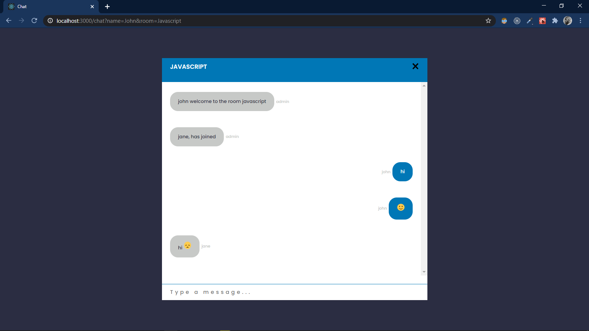

# Chat

---

---

## ABOUT

This is the "Chat" project written in Javascript and express and socket.io and react and its going to ask you a username and room name
and then send a welcome message by admin and has total users count
in the info bar and able to handle emojis and auto scroll to bottom and connects to a express
server that uses socket.io

---

## INSTALLING

`npm install`

`npm start`

## BUILT WITH

-Node

- Express
- Socket.io
- Websocket
- React
